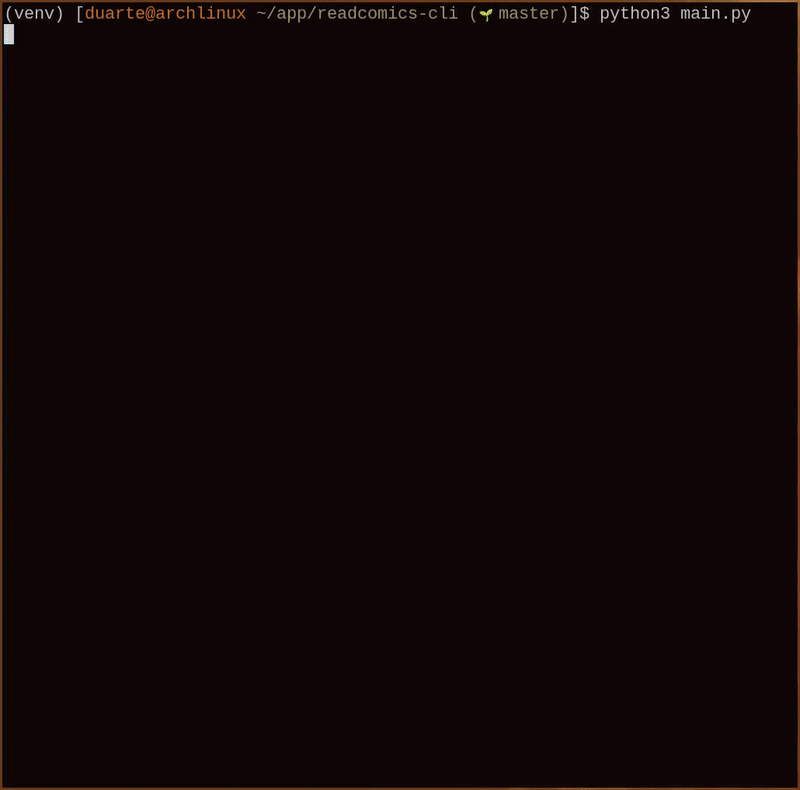

# readcomics-cli

Search, browse, and download comics from [readcomiconline.li](https://readcomiconline.li) straight from your terminal.

Features inline cover art previews, concurrent downloads, and an interactive TUI powered by [Rich](https://github.com/Textualize/rich).

## Install

```sh
# Clone the repo
git clone https://github.com/your-username/readcomics-cli.git
cd readcomics-cli

# Create a virtual environment and install dependencies
python3 -m venv venv
source venv/bin/activate
pip install -r requirements.txt

# Install the Playwright browser (one-time setup)
playwright install chromium
```

## Usage

```sh
python main.py
```

This launches an interactive session:

1. **Search** - type a comic name
2. **Pick a comic** - see a cover art preview, genres, and summary
3. **Pick issues** - select one, a range, or all
4. **Download** - pages are fetched and downloaded concurrently (defaults to `/downloads`)

### CLI Flags

| Flag | Description |
|---|---|
| `-s`, `--search QUERY` | Skip the search prompt and jump straight to results |
| `-o`, `--output-dir PATH` | Set the download directory (default: `./downloads`) |
| `--no-headless` | Show the browser window (useful for debugging) |

## Dependencies

- [Playwright](https://playwright.dev/python/) - headless browser for scraping pages behind Cloudflare
- [httpx](https://www.python-httpx.org/) - HTTP client for concurrent image downloads
- [Rich](https://github.com/Textualize/rich) - tables, progress bars, styled output
- [Pillow](https://python-pillow.org/) - inline cover art rendering in the terminal

## Demo



## License

This project is for educational and personal use only.
